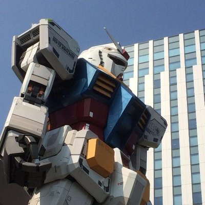

# キャリアとは自由であること

<div class="flush-right">
FORTE@FORTEgp05
</div>

この章を執筆したFORTE（フォルテ）です。今回は職ということで、20年ほど社会人をやってみた2026年でキャリアについて思うことを書いてみました。なお、内容は元となった次のnote記事<span class="footnote">https://note.com/fortegp05/n/n3decc5132428</span>があり、それに追記をしたものとなります。

{width=50%}

## これまでをふりかえる
ITエンジニアとして業界歴19年目になりました。新卒で中小SIerに入社し、9年目でWeb系に転職し自社サを転々として、SESの2社目にいます。自己紹介がてらここまでの経歴をふりかえりつつ、ようやく自由になれた、もっと自由になれそうという話をお伝えします。

## 2007年～新卒～
私は1987年生まれなので、2007年は20歳でした。正確には早生まれなので、新卒の就職活動時は19歳。内定後の懇親会が誕生日前だったので「（未成年だから）酒はダメなんで」「オレンジジュースください」という感じでした。

### 学生時代
学生時代は2年制の情報系専門学校に通っていました。大学でいうと短大みたいな感じでしょうか。こう書くと「学生のときから明確にIT系という将来があったんですね」と言われそうですが、当時はまったく別のことを考えていました。


> 他に食べる方法を知らんからさ。
> 
> だから、いまだに嫁さんも貰えん
> <div class="flush-right">
> クワトロ・バジーナ
> </div>

なんとなくIT系に行ったので、もちろん就職先もIT系で、本当はもっと様々な未来があったかもしれないのに「IT系でいいか」「IT系しかないよな」という感じでした。だから「IT業界に憧れて入ってきました！」という昨今の若者を見ると、どこかで自分が得られなかった「何か」を持っている眩しさを感じずにはいられません。

## SIerのSE
SIerとはSI（Systems Integrator: システムインテグレーター）を行う企業のことを指します。例外はあるでしょうが、多くの場合SIerに所属するITエンジニアはSE（System Engineer: システムエンジニア）と呼ばれます。私も受託開発のSEとしてIT業界のキャリアがスタートしました。

このときは見積から保守運用までという感じで、お客様から引き合いを頂いて要求を元に見積を作り、競合他社との受注合戦をくぐり抜けたら要件定義をしてスケジュールを引き、人を集めたり自分でコードを書いて、納品・リリース、保守運用しつつ次の案件ないですかね？なんて営業トークする感じでした。

## システム開発への絶望
それだけで済んだらこの記事は生まれなかったでしょう。しかし、そうはならなかった。ならなかったんです。

### システム開発は難しい
当時2010年代に入ってもシステム開発というものは、うまくいかないものでした。いわゆる「炎上」というやつで、納期が3月末だとすると2月くらいから帰宅は終電となり休日はなくなります。なんなら会社に泊まるので家に帰らなくなります。それが1～2ヶ月は続きます。

炎上する原因は様々であり私自身もいろんな理由を見てきました。でもそのとき最も足りていなかったのは「システム開発をうまくやる工夫」でした。（最近の私はこれをマネジメントと呼んでいます）

### 足りないマネジメント
SIerにだっていわゆるマネージャーはいます。役職名としては課長とか部長とかの方が多いと思いますが。その方々がマネジメントをしていないのか？というとそうではないのです。では無能なのか？というと（大多数は）そうでもない（はず）のです。

ただ、私も含めて誰も「システム開発をうまくやる工夫」を知らなかったのです。当時の私の上司である40代後半の課長はこう言っていました。

> システム開発が上手くいことなんて一生に1、2回だよ
> 
> <div class="flush-right">
> 当時の課長
> </div>

だからルールの意味や背景も考えずに盲目的に会社が決めた開発ルールに従い、炎上し、本番障害や納期遅延を出してお客様に迷惑をかけては開発ルールが増え、工数とやることは増え続ける。そんな悪循環に陥っていました。そして、その現状に私は **絶望** しきっていました。もうIT業界を辞めようかと思うほどに。

## 希望とは知ること
そんな私の絶望が **希望** に変わったのは以下の言葉を知ったからでした。

> もっとうまくソフトウェアを届けるやり方を探し求め、分かちあい、見出していこう
> 
> （でもあんまり深刻に受け止めすぎないで。楽しみながらやっていこう）
> 
> <div class="flush-right">
> ジョナサン・ラスマセン著 アジャイルサムライ
> </div>

システム開発を楽しんでいいんだよ。君だって楽しく仕事していいんだよ。アジャイルサムライを読んでそう言われた気がしました。

### きっかけはテレビゲーム
このアジャイルサムライを知ったきっかけはテレビゲームでした。前代未聞の発売したゲームの作り直しを宣言したオンラインゲーム（MMO）、ファイナルファンタジーXIV（FF14）です。このゲーム作り直しには「うまくやる工夫」としてアジャイルの考え方が採用されており、その入門書として紹介されていたのがアジャイルサムライです。

いちど発売したゲームを作り直すという失敗から成功への事例を知った私の絶望は、大いなる **希望** に変わっていました。

#### 詳しくはPodcastで
なお、このあたりまでの詳しい話は次のPodcast<span class="footnote">https://play.fountain.fm/episode/F2DwyVw8bDxl9R1kjy4B</span>で喋っていますので良ければ。

{width=50%}


## 2016年～転職～
それからもっとアジャイルをやりたい、外の環境でやってみたいと思い2016年に初めて転職しました。Sierから自社サービス系の事業会社に行き、2022年までに3社で働きました。Web系と言いつつスマホアプリ（Android）開発もやっています。

### 転職の理由
転職時の面接では理由として次のように話していると思います。

* 1社目: 異動でやりたいことができなくなってしまったため
* 2社目: 新しい技術をやりたいと思ったため
* 3社目: 規模が大きい環境でマネジメントを学び実践したいと思ったため
* 4社目: （いろいろあって）給料が下がったため
* 5社目: 日本のIT業界を良くしたいため、年収が上がる（1.5倍以上）ため

## 2022年～SESの現場リーダー～
前職はSES（System Engineering Service: システムエンジニアリングサービス）の会社なわけですが、実は採用面接のときはSESであると認識していませんでした。さらに当時も今も「なにをもってSESと呼ぶのか？」が分からないままです。

とあるSNSでSESのコミュニティがあったので「SESの定義を教えて下さい」と聞いたところ「まずITエンジニアの定義が必要」のような回答になってない回答が来るしまつ。分かりやすいのでSESと名乗ってますが、SESってなんなんでしょうか？

### 悪名高いSESで満足している私
ひところSNSで「ITエンジニアの転職先を探しています」という投稿には必ずと行っていいほど「SESはNG」と書かれていました。SESはそれくらい業界から印象の悪い契約形態、働き方なのです。それでも自分は客先常駐SESの現場リーダーとして楽しんでいましたし、満足もしていました。少なくとも2年半ほどはそこで働いていました。

### 満足できていた理由
これには次のような理由があります。

* 客先常駐ではあるがフルリモート
* 現場リーダーであるため（良くも悪くも）裁量がある
* 必要ならお客様からの作業依頼を断れる
* 実際やってみるとSESはSIerのSEっぽい
* よく聞くような悪いSESあるあるはなかった

## 人は選択できる自由を求める
結局のところSESかどうか、SIerか、自社サービスかではなく、私は自分が選択できる自由を求めていることに気付きました。

```text
やりたいと思ったことをやる、やりたくないことはやらない他人に強制はしないし、自分もされたくない
```

そしてこの自由さは副業を始めたことでさらに実感できました。

### 副業を始めた～自由になる～
サラリーマンになったのは当時の自分にそれ以外の選択肢がなかったからですが、いままで辞めなかったのは確定申告が嫌すぎたからです。年末調整でさえ面倒なのに、自分で帳簿を付けてなんて考えられませんでした。

そんな私が2024年から副業を始めました。

### 始めた理由
会社の上司からのおすすめでもあるし、資産運用するための軍資金を用意するなら会社の給料を上げる努力よりアルバイトや副業したほうが実入りがいい、これから先を考えるとサラリーマンの経験だけより個人事業主の経験があったほうがいいなどの理由からでした。

## 選択できる自由
SIerのSE、自社サービスのエンジニア、SES、副業での個人事業主と経験してみて、自分の人生で最も重要なのは「選択できる自由」だと言うことに気づきました。もっと言えば **選択できる自由を実現し続けられる環境、能力、マインドセット、資産、人間関係などあらゆるものが必要であり大事** だと思っています。

## 選択した結果
2026年6月現在、選択できる自由を行使した結果、4回目の転職をして5社目で働いています。前職と同じくSESがメインの会社ですが、会社の規模が異なるので体感では前職とまったく異なります。

### 自由を選び楽ではなく楽しむ
前職は非常に楽な環境でした。鬱病だったこともあり、あまりバリバリ働けなかった自分としては非常に働きやすい環境だったと思います。しかし **楽しかったか？** と言われると、それは違うかなという感じでした。

### やりたいと思ったときに動ける
アジャイルサムライに救われた私は、ソフトウェア開発を楽しめる様になっていました。もっと多くの開発現場に赴き、若手を含むもっと多くのソフトウェア開発者を幸せにしたいと思ったときにより大規模の会社に行くことで私自身も開発現場に行きつつ、他のソフトウェア開発者の支援をすることができると思ったのです。

そして幸運なことにそれを選択できる自由が、自由を実現し続けられる様々な要素が私にはありました。動くことができ、結果としてその環境を手に入れられることができたのは、自由というキャリアであったと思います。

## 人事を尽くして天命を待つ
会社の若い子と話しているとよく「会社がやってくれない」「上司がケアしてくれない」という話を聞きます。若い子どころか私より年上のソフトウェア開発者が「部の方針が分からない」「教育施策がない」なとど言って立ち止まっている始末。

> 技術的卓越性と優れた設計に対する不断の注意が機敏さを高めます。
> 
> <div class="flush-right">
> アジャイルソフトウェア開発宣言
> </div>

技術だけでなく、キャリアについても不断の注意が必要だと思っています。選択できる自由を実現し続けられるありとあらゆるものは向こうから勝手にやって来るものではありません。セレンディピティも含めた自発的な行動、自由を得ようとする営為から得られるものだと思います。あなたはその自由のために人事を尽くしていますか？

### でも無理はしない
持続的であること、これも非常に大事です。私も前職は楽を求めていました。その期間があったからこそ、リファラルという縁を得て転職という天命が得られたのかもしれません。 **立ち止まっても、また歩き出せること** は人生の大部分を占める職においては非常に大事なことだと思います。

## 自由に幸せを
「その自由がないから悩んでるんだ」という方もいらっしゃるでしょう。そうであれば答えは簡単です、自由を得ようとする努力をするだけですから。もちろんそれは簡単でも楽でもありません。きっと大変なことでしょう。だからこそ、本著のような多くの先人の肩に乗れ、知の高速道路を走る事ができる書籍は貴重だと思います。無理せず、一緒にやっていきましょう。

#### 本章の執筆者

<div class="author-profile">
    
    <div>
        <div>
            <b>FORTE（フォルテ）</b>
            <a href="https://twitter.com/FORTEgp05">Twitter@FORTEgp05</a>
        </div>
        <div>
            サークル名：aozora Project
        </div>
    </div>
</div>
<p style="margin-top: 0.5em; margin-bottom: 2em;">
ソフトウェア開発者ですが、いろいろやってます。Twitter、ブログ、Podcast配信、数多くの趣味と楽しく活動中。
