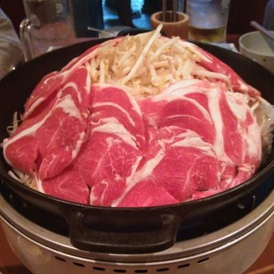

# 404 no job:仕事でのメンタル不調から約7年かけて社会復帰を行うまでの道のりの振り返り

Aizack(@ykokubo09)

### はじめに
1. 自己紹介
    1. jobに至るまでの道筋  
        学生時代からまっすぐなキャリアを通ることができない人間でした。高校は体調不良で通えなくなり、不登校の末に中退。高卒認定試験（旧：大検）を取得して、浪人の後に入学した大学でも留学後に心身の不調で休学。そこから就職活動を行って都内に本社を持つ独立系SIerに至ってようやく就職(job)まで行き着きます。言ってしまえば、様々な逸脱と復活を経験した「統計的外れ値」な生き方ではありますが、こういう人もいるんだなぁ位の気持ちで読み進めていただけると幸いです。
    2. これまでのキャリア  
        SIerではシステムエンジニアという形で客先にシステム開発、およびプロジェクト支援（PMO：Project Management Organization）という形で常駐しておりました。上長や先輩、客先のプロパーさんに恵まれ、充実した仕事生活を送っておりました。しかし、前述のような生来の虚弱さに加えて、身内の不幸が重なってメンタル不調を抱えて働けなくなりました。その後、無理をしてお仕事をしていました。しかし、怪我や病気が悪化し2年ほど休養の末に現在に至ります。
    3. 現在の状況   
        ワンストップ職(job)への寄稿ではありますが、現在の私のステータスは「no job(無職)」です。正確には、福祉サービスの就労移行支援事業所を活用して復職に向けた訓練を実施しています。具体的には、就労に向けた講座[^1]の受講とUdemy Businessを活用した技術学習および転職用ポートフォリオ作りを行っています。加えて、担当の支援員さんと週次1on1やエンジニアの支援員さんに技術レビューや相談する機会（2週間に1回目安）もいただいています。  
        私の場合はすでに2作程ポートフォリオは作成しGithubに公開[^2]しており、事業所での企業向け発表会や外部のコミュニティイベントで共有しています。元々技術コミュニティやイベントに参加していた背景もあるため、スライド[^3]や技術ブログ[^4]としてもまとめる等のアウトプット活動も行っています。綺麗なキャリアを描けていないからこそアウトプットを通じて、「話の通じる人」である証明を行っています。  
        
        [^1]:内容としては、生活習慣の見直し、ビジネスコミュニケーションの実践、応募書類の書き方、面接練習などを行っています。リワークプログラム等を経験したことある方からすれば、STS(ソーシャルスキルトレーニング)という言い方が馴染み深いと思います。

        [^2]:[IR分析・ETLプロジェクト](https://github.com/Zack-K/ir_analyses)として、金融庁のAPIからPythonで取得・加工して、DBに保存の後、簡易的なダッシュボードで表示するアプリケーションです。
        
        [^3]:脚注2のIRプロジェクトを紹介する[スライド](https://docs.google.com/presentation/d/1pk1N8Uh_W8DNQmTIk4X5j-8eU7gem9kHHa9s0-0PzEo/edit?slide=id.g3a28cbc060a_1_0#slide=id.g3a28cbc060a_1_0)です。企業向け発表会や登壇で利用したものです。

        [^4]:脚注2のIRプロジェクトを紹介する[ブログ記事](https://aizack.hatenablog.com/entry/2025/10/07/191337)です。スライドでは書ききれなかった失敗や工夫・苦労をまとめました。

2. なぜこの原稿を書こうとおもったのか
    1. 背中を押されて
    2. 過去の自分を救いたくて
3. 体を壊してから今までの流れ（概要）
    1. 不調のきっかけ〜不調
    2. お休み期間（実際は休んでいない）
    3. 無理して働く期
    4. 心身を壊して、リハビリ期
4. 今行っている社会復帰を目指すための準備
    1. 就労移行支援事業所とは
    2. 訓練内容とそこでのアウトプットたち
    3. 転職活動の状況
### 不調のきっかけ
1. 社会人一年目からの客先常駐
2. 存在価値を認めてもらうため無理して頑張る
3. 自分への失望
4. 身内の不幸とプロジェクトのトラブル・リリースが重なる
5. メンタル不調を起こし、休職
### 休職・退職〜失業保険期
1. 休職期間
2. 一時的に復帰、そして退職へ
3. 失業保険受給
### 無理して働く期
1. 失業保険が切れそう
2. 社会福祉協議会からのコロナ禍特別借り入れ
3. 失業保険が切れたので、無理して働く
4. 無理した結果、もう一回メンタル不調へ
### 心身のリハビリ期
1. 抱えた疾病や怪我・メンタル不調たち
2. どうやって糊口（ここう）をしのいだか
3. 心身の健康を取り戻すためにやったこと
### 福祉サービスを利用して回復期
1. 障害者手帳取得
2. 自立支援医療申請
3. 障害年金申請
4. 訪問看護サービス
5. 居宅家事支援サービス
### 就労移行支援事業所を活用した社会復帰準備期
1. 社会復帰準備
    1. 就労移行支援事業所とは
    2. 複数の事業所での体験訓練
    3. 参加する事業所の決定とその背景
2. 訓練の内容
    1. 職業準備性の訓練
    2. 支援員との定期面談をとおしたフィードバック
3. スキルを磨く
    1. Udemy Businessを使った自習
    2. 転職用のポートフォリオ作成
    3. 技術担当エンジニア支援員との定期面談
### まとめ
1. 不調期間を振り返って
2. 今後の社会復帰にむけて

### コラム(1)： 闇の魔術に対する防衛術 自分の守り方
1. 「困った面倒な人」として扱われないように気をつけること
    1. 自分の「弱さ」「できない」「病気」「特性」を受け止めること
    2. 感情から発生する怒りや攻撃性をコントロールすること
    3. 極めて冷静に、法・規則・論理という共通言語（プロトコル）で相手と会話すること
2. 役所の方、お医者様とより良いコミュニケーションを取るには
    1. 解決したい問題を明確にした上で相談すること
    2. 相手の面子を守りつつ意思表示すること
    3. ネットに投稿するのは最終手段、必殺技なので簡単に行ってはならない
3. 元うつ病患者からのアドバイスやマウントから身を守るには
    1. 話を聞いても良い「元患者」を見極めること
    2. その人の源泉は、怒りor慈しみ？
    3. 最終的に自分しか責任は取ってくれない
4. 法律上のトラブルは「法テラス」を利用する
    1. 収入が少ない場合の最後の砦「法テラス」に連絡する
    2. 紹介された近隣の弁護士さんに相談をする
    3. 代理人として弁護士を盾に交渉をすすめる

### コラム (2) : 自問自答、もし今の自分の知識で「あの頃」の私へアドバイスするなら
1. 面倒になって、投げやりになっていませんか？
2. 誰かに相談するのが億劫になっていませんか？
3. 自分もOK、相手もOKの解決策や妥協案を目指せていますか？

#### 本章の執筆者

    
    

        

            <b>Aizack </b>
            <a href="https://twitter.com/ykokubo09">X@ykokubo09</a>
        

    

元システムエンジニア、テクニカルサポート。現在は就労移行支援事業所を通じて転職活動中。適応障害、うつ病をきっかけに約7年程時々お仕事しながら療養・社会復帰準備などを行っている。  
実務経験は3年程だが、療養中もなんだかんだXのエンジニア界隈にいたので「門前の小僧習わぬ経を読む」というやつでシステム関連わりと大好き。  
最近は独学でAWSのSAA資格を取得。転職活動中です。

