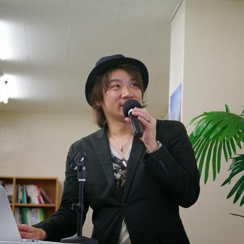

# モバイルアプリエンジニアという職を作り直す

fumiyasac

**Web・iOS・Android・Flutter・Backend・登壇・同人誌。きれいではないキャリアを仕事に変えてきたN=1の記録**

## はじめに

自己紹介を求められたとき、私はたいてい「iOS/Androidのアプリケーションを開発しているエンジニアです」と答えてきました。それは今も大きく間違ってはいないのですが、最近の自分の仕事を振り返ると、その一言だけでは少し足りなくなってきています。

Flutterで画面を作り、TypeScriptのBackend処理を読み、Firestoreのデータを確認し、Cloud LoggingやBigQueryを眺め、QA評価戻りやお問い合わせ対応から事象を辿る。わしゃモバイルエンジニアやぞ、と思う瞬間もあるのですが、こうした横断的な経験が自分の職を少しずつ作り直している感覚があります。

この文章では、WebからiOS、Android、Flutter、そしてプロダクト横断へと移りながら、綺麗とは言いがたいキャリアを記事・登壇・同人誌・コード・事業成果といった証憑で縫い合わせてきた話を書きます。N=1の記録です。誰かへの処方箋ではなく、続けていたら結果的にこうなっていました、という話として読んでもらえたらと思います。

## 職業名だけでは自分の仕事を説明できなくなった

「iOS/Androidのアプリケーションを開発しているエンジニアです」

この自己紹介をかれこれ何年も使ってきました。仕事の中心がモバイルアプリ開発であること自体は今も変わっていません。ただ、その周辺で手を動かしている時間が年々増えていて、職業名の輪郭がじわじわとぼやけてきた感じがあります。

ある機能で不具合が報告されたとします。まずアプリ側のログを見て、画面の状態遷移を追います。それだけで原因が分かればいいのですが、たいてい分からないのでBackend側の処理を読みにいきます。TypeScriptのコードを開いてAPIのレスポンスがどう組み立てられているか確認し、Firestoreのデータ構造を見て想定と違う値が入っていないか調べ、Cloud Loggingで時系列を追い、BigQueryに集計されたデータと突き合わせます。QA評価戻りの内容から再現条件を絞り込み、問い合わせの文面からユーザーが実際に体験した事象を推測してログで裏付けます。画面を作るだけではなく、画面の外側で何が起きているかを辿る時間が明らかに増えてきました。

モバイルアプリエンジニアなのに、なぜここまで見ているんだろう。そういう戸惑いは正直あります。ただ、その戸惑いの先に次の職域のヒントがあるような気もしていて、職業名というのは自分の中で固定されたラベルではなく、現場で引き受けたことによって後から形が変わっていくものなのかもしれないと最近は思うようになりました。名乗りとしてのモバイルアプリエンジニアは変わっていなくても、中身はかなり変わっています。職名を守ることより、目の前の事象を辿れることのほうが後々の自分を助けてくれるのではないか。そういうことを、ぼんやり考えています。

## WebからiOSへ最初の越境

最初からモバイルアプリエンジニアだったわけではありません。私のエンジニアとしてのキャリアはWeb系の開発から始まりました。サーバーサイドやフロントエンドの実装を経験した後、ある時期にiOSアプリ開発へ移ることになります。

移る、と書くとあっさりしていますが、実際にはかなり不安の大きい時期でした。iOSの開発経験はほぼゼロで、周囲にはiOSを何年もやってきた人がいます。自分がiOSエンジニアですと名乗っていいのかよく分からないまま、とにかく手を動かすしかありませんでした。

やれることから始めるしかなかったので、小さな個人アプリを作ってみたり、UI実装の知見を記事にまとめてみたり、勉強会に出てみたり、サンプルコードを公開してみたりしました。どれも大したものではなかったはずですが、少しずつ外から見えるものが積み上がっていく感覚はありました。iOSエンジニアになろうと決意してからなったのではなく、手を動かして外に小さな成果物を置いていくうちに、いつの間にかそう呼ばれるようになっていました。実際のところそちらのほうが正確な記述です。

肩書きよりも先に、コードや記事が自分の説明材料として機能していました。なりたい職があるなら名乗るよりも先にその職に近づくための証憑を作る必要があります——と書くと教訓めいてしまいますが、当時そんなことを考えていたわけではなく、不安だったから手を動かしていただけです。それが結果的に後から自分を助ける材料になっていました。そのくらいの話です。

## iOSに加えてAndroidにも携わり隣のプラットフォームを見る

iOSの開発にある程度慣れた頃、Androidアプリの開発にも関わるようになりました。壮大な計画があったわけではなく、現場の都合でAndroid側も見る必要が出てきたという経緯だったと思います。

最初はiOS側の知識を頼りに、こっちではこうやっていたけどAndroidではどうなっているのか、と対比しながら手探りで学んでいきました。当然ながら同じようには書けません。UIの組み立て方、ライフサイクルの考え方、画面遷移の管理、それぞれにiOSとの差分があります。ただ、しばらく両方を行き来していると、単なる違いとして見ていた差分の中にそれぞれのプラットフォームの設計思想が透けて見えるようになってきました。

SwiftUIとJetpack Composeが出てきた頃はとくにそう感じました。どちらも宣言的に画面を組み立てるという方向性は共通していますが、状態管理の考え方や既存のフレームワークとの共存のさせ方には違いがあります。片方だけを知っていたらそういうものだで終わっていたかもしれないことが、両方を見ているとなぜこちらではこうなっているのかという問いに変わります。iOSの正解をAndroidに持ち込むのではなく、違いを観察して差分を説明できるようになること。これが結果として、モバイルアプリエンジニアとしての自分の強みの一つになっていきました。

隣のプラットフォームを見ることは、扱える技術を増やすこととは少し違いました。隣を見ることで、自分がそれまで慣れ親しんでいた技術の癖や暗黙の前提に気づけるようになります。UI実装や状態管理のような自分が得意だと思っていた領域についても、なぜ自分はこう書いているのかを言語化できるようになります。越境は技術スタックの幅を広げるだけでなく、元いた場所の解像度も上げてくれるものでした。

## 仕事を外に出せる形へ変換する

業務でコードを書き、画面を作り、レビューをし、リリースをする。仕事としてはそれで回っていきます。ただ、それだけでは自分のやってきたことが外から見えにくい。とくに綺麗な一本線のキャリアを歩いてきたわけではない人間にとっては、外から検証できるものを残しておくことに思った以上の実用的な意味がありました。

最初に書いた技術同人誌は、UI実装に関する内容でした。業務や個人開発で得た知見をまとめたもので、正直そこまでの手応えがあったわけではなかったのですが、ありがたいことに後に商業誌化される機会をいただきました。自分が一番驚いた出来事かもしれません。

iOS系カンファレンスのパンフレット原稿には複数年にわたって応募を続け、採択されたりされなかったりしながらも書き続けてきました。勉強会やカンファレンスでの登壇もそれなりの回数を重ねましたし、Android系カンファレンスの公式アプリにContributionしたこともあります。技術書籍のレビューや翻訳レビューに声をかけていただいたこともありました。

こうした外部アウトプットの動機を誰かに聞かれると答えに詰まるのですが、少なくとも華やかな活動をしたかったわけではなく、仕事で感じた手触りや違和感を社外で説明可能な形に変換する作業を繰り返していたら積み上がっていた、というのが近いと思います。業務の中で気づいたことがあっても、業務の文脈から切り離さないと外には出せません。だから抽象化して一般化して自分の言葉で書き直します。その変換をずっとやってきました。

仕事の中身としても、施策開発だけをやっていたわけではありません。クリエイター向けサービスで外部広告基盤と連携したモバイルアプリ機能の開発を担当したことがあります。iOSとAndroidの両方で実装し、外部パートナーやBackendチーム、デザイナーと連携しながらレガシーな画面を含む複数画面に機能を導入しました。数字として見える事業成果につながった仕事で、職務経歴のなかでも説明しやすい仕事の一つです。

一方で、地味な仕事もたくさんありました。施策開発が進むなかで滞留していた改善PRを拾ったり、協力パートナーのPRレビューを支援したり、自分の主担当領域ではないコードを読んで可能な範囲でレビューを返したり。派手ではありませんが、開発フローや現場の信頼関係を守るために誰かがやる必要のある仕事でした。こういう仕事は外から見えにくいのですが、プロダクト開発の現場ではこの手の地味な仕事がかなり効いてくる場面があります。

事業成果と技術実装と外部証憑、この三つがつながると自分の職を説明しやすくなります。こういう仕事をして、こういう成果が出て、そこで得た知見をこういう形で外に出してきました、と言えるようになります。綺麗な経歴ではないからこそ、外から検証できるものに助けられてきたというのが正直な実感です。仕事とアウトプットは別々のものではなく、仕事で手触りを得てそれをアウトプットに変換し、アウトプットがあることで次の仕事で自分を説明できるという循環がありました。

## 今はログやDBだって見る

現在はFlutterを使ったモバイルアプリの開発に関わっています。画面を作りウィジェットを組み立て状態管理を設計する、仕事の中心がそこにあることは変わりません。ただ、仕事がFlutterの画面実装だけで終わることはほとんどなくなりました。

画面側のコードを追っても原因が見えなければTypeScriptで書かれたBackendの処理を読みにいきます。APIのレスポンスの中身を確認し、その元になっているFirestoreのデータを見ます。データの状態がおかしければいつからおかしくなったのかCloud Loggingの時系列で追い、BigQueryに蓄積されたデータと突き合わせて影響範囲を確認します。QA評価戻りから再現条件を絞り込むこともあれば、問い合わせの内容からユーザーが実際に体験した事象を推測してログで裏付けることもあります。Slack上に散らばった過去のやり取りや以前の調査メモを拾い集めて調査方針を立てることもあります。

モバイル、Backend、DB、ログ、問い合わせ対応。これらを横断して結局何が起きていたのかを説明するという仕事が明らかに増えています。

Firestoreのドキュメント構造を睨んでいるとき、BigQueryのクエリを書いているとき、Cloud Loggingのフィルタを調整しているとき、わしゃモバイルエンジニアやぞ、と心の中でつぶやく瞬間は正直あります。自分はいったい何屋なのか分からなくなることもあります。

でもこの横断経験が今の自分の職域を確実に広げてもいます。画面を作れるだけではなくプロダクトの中で起きている事象を辿れること、問い合わせの文面から仮説を立てログで裏付けBackendの処理を確認しデータの状態を見てこういうことが起きていましたと説明できること。モバイルアプリエンジニアの職名には含まれていないかもしれませんが、モバイルアプリを開発する仕事の一部にはもうなっています。しんどいですが、かなり効いている経験でもあります。モバイルアプリエンジニアの仕事は画面の中だけでは完結しなくなっている、ということを身をもって感じています。

## 職は肩書きではなく証憑で説明する

ここまで書いてきて改めて自分のキャリアを振り返ると、まあギタギタだなと思います。Web開発から始まりiOSへ移りAndroidにも手を伸ばしFlutterを書くようになりました。その間に事業会社、受託開発企業、フリーランス、業務委託と働き方もいろいろ変わっています。転職もしましたし独立した時期もありましたし業務委託として関わった現場もあります。一本道のキャリアとはとても言えません。

ただ、道は折れ曲がっていてもその折れ曲がった先々で外に出せるものが残っていました。コード、記事、登壇資料、技術同人誌、Contribution、パンフレット原稿、事業成果。こうした外から検証できる証憑があったことで、折れ曲がったキャリアでも自分のやってきたことを説明でき、次の仕事にもつながりました。肩書きや会社名では説明しにくい経歴だからこそ、何を作ったか、何を説明できるか、何を外に残したかが自分を助けてくれました。

これは戦略的に設計した結果ではなく、気がついたらそうなっていたというのが実態です。自分の根底にあるのは、かっこよく言えば無欲なる学習願望とでも呼べるもので、強い肩書きが欲しかったわけでも市場で目立ちたかったわけでもなく、分からないことを分かるようにしたい、作れなかったものを作れるようになりたい、説明できなかったことを説明できるようになりたいという気持ちで続けてきたら、触れる範囲がWeb、iOS、Android、Flutter、Backend、ログ、DBと広がっていました。

外部証憑を作ってきたことの動機も、承認欲求だけでは説明しきれません。誰かに読んでもらいたいとか採択されたいとかいう気持ちがなかったとは言いませんが、それ以上に自分の仕事を説明可能にするための足場として機能してきたという実感のほうが大きいです。

職を選んだというより、その時々で職を少しずつ作り直してきました。iOSエンジニアと名乗っていた時期もAndroidエンジニアと名乗っていた時期もFlutterエンジニアと名乗っている今も、どの時期も職名だけでは説明しきれない仕事をしていて、そのはみ出た部分を証憑として外に残すことで、自分なりの職業観がゆっくりとできてきたのだと思います。

## おわりに

モバイルアプリエンジニアという職は、自分の中で何度も形を変えてきました。最初はWebからiOSへの転身で、そこからAndroid、Flutter、Backend、ログ、DB、問い合わせ対応へと職域が少しずつ広がっていきました。その度に不安はありましたが、手を動かして外に出せる形に変換することを続けてきたおかげで、曲がりくねったキャリアでもなんとか自分の仕事を説明できるようにはなりました。

たぶんこれからも自己紹介ではモバイルアプリを開発しているエンジニアですと言うと思います。それは間違っていません。ただその言葉の中には、画面実装だけでなくBackendを読むこと、ログを見ること、QA評価戻りを追うこと、問い合わせから事象を辿ること、そしてそれらを外に出せる形へ変換することも少しずつ含まれるようになりました。

職は最初から綺麗な名前で用意されているものではなく、日々の仕事とその仕事をどう説明してきたかによって後から少しずつ形になるものなのかもしれません。私はこれからも職業名に自分を閉じ込めすぎず、現場で必要になったことを学び、作り、書き、話しながら、モバイルアプリエンジニアという職を自分なりに作り直していきたいと思います。

#### 本章の執筆者

    
    

        

            <b>fumiyasac</b>
            <a href="https://twitter.com/fumiyasac">Twitter@fumiyasac</a>
        

        

            サークル名：Just1factory
        

    

元デザイナーからジョブチェンジをしたモバイルアプリエンジニアです。
アプリのUI実装が好きで、平素の業務以外でもQiitaやGitHub等でUI実装に関するサンプルや解説記事を投稿しています。
iOSDC Japanではパンフレット掲載記事の6年連続採択と2回の登壇を経験しました。
技術書典への参加がきっかけでiOSアプリ開発におけるUI実装関連の商業誌を3冊出版する機会にも恵まれ、技術系同人誌への寄稿やモバイルアプリ関連の勉強会での登壇も続けています。
課外活動としては「技術書同人誌博覧会」のコアスタッフとして、クリエイティブ制作と公式Webサイトの保守管理にも携わっています。
アイデアを練ったり設計のためのメモや図解を作るときは、もっぱら手書きで描くことが多いです。
まだまだ学ぶことは山ほどありますが、「整理・負担を軽く」と「感謝され期待に添えること」の2つを軸に、今日も技術を磨いています。

