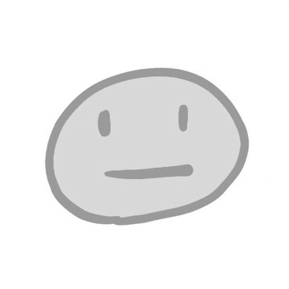

# 探すのをやめて、組み立てはじめた

mae616@mae616_

自分に合う仕事は、どこかにきっとある。
ずっと、そう思っていました。

私は、はじめはSEとして働き、そのあとWebのエンジニアになりました。
いまは「フリーランス準備中」と名乗っています。
開業はしているのですが、開発の仕事はまだ受けていません。
仕事としてではなく、アプリやOSSを自分で作ったり、
すでにあるものに手を入れたりしています。
技術同人誌を書いたり、AIで音楽やイラストを作ったりもしています。

これは、自分に合う職種を探すのをやめて、
自分で組み立てはじめるまでの話です。

## 「好き」だから選んだ仕事

「将来は何になりたい？」と聞かれて、
うまく答えられる子どもではありませんでした。
なりたい職業が、わからなかったからです。
それでも、自分に合う仕事はどこかにあるのだろうとは思っていました。
まだ出会っていないだけで、探せば見つかるものだと。
どこかにあるという前提そのものを疑ったことは、
一度もありませんでした。

プログラミングに出会ったのは、そのあとです。
自分の書いたものが、書いたとおりに動く。
そのことを、素直に好きだと思えました。
だからエンジニアになることに、迷いはありませんでした。
好きなことを仕事にできたのだから、自分にはきっと向いているのだろう。
そのときは、そう思っていました。

## はしごの先は、二択だった

エンジニアのキャリアは、技術を深めるか、マネジメントに行くか。
だいたい、この二択で語られます。
プログラマーからエンジニアへ。
そこまでは、はしごがありました。
その先を考えたとき、どちらもピンときませんでした。
やってみたら分かるかもしれない。
そう思って、両方やってみました。
技術を深める道も、マネジメントの道も、違いました。
負荷も、たしかに強くありました。
ただ、それより大きかったのは、
やりたいと思っていたことと違っていた、ということです。

振り返れば、SEとして働いていた頃から、
設計する人と実装する人が分かれていること自体に、
落ち着かないものを感じていました。
一度は小さな会社に移り、設計から実装まで自分でやることで回避しています。
ただ、その先では、同じ手が使えませんでした。

作っているもの全体を見ていると、
こうしたほうがいい、と思うところが出てきます。
「もうちょっとこうしたいんです」と言ったことがあります。
返ってきたのは、「これは別の人が考える話です」でした。
デザインについても、こうしたいと思うことはありました。
ただ、それは言えませんでした。

言われてみれば、そのとおりでした。
職種とは、領域を分けるための仕組みです。
誰がどこまでを引き受けるのかを決めておくから、仕事が回る。
あの返答は、その仕組みが正しく働いた結果でした。
私がやりたかったのは、領域をまたぐことでした。
分けるための仕組みと、またぎたいという思いは、
はじめから噛み合っていません。
合わない会社に当たった、という話ではないのです。

会社を変えても、職種はあります。
どこへ行っても、線は引かれている。
では結局、自分は何をしたらいいんだろう。

## 一回、はしごを外してみる

線の内側にいたままでも、仕事はあります。職種もあります。
ただ、この先へ進んでも、
いつか行き止まりになるのではないか。
この先どこへ伸びていけるのかが、見えませんでした。

一回、外してみよう。そう思いました。

会社を離れ、フリーランスになりました。
最初は、所属が変わるだけで、
仕事の中身は変わらないと思っていました。

実際に変わったのは、そこではありませんでした。
「エンジニアだから、こう働く」
「自分の担当範囲だけ、意見を言う」。
その前提から、距離を取れたことです。
技術同人誌を書く。AIで音楽やイラストを作る。
これはエンジニアの仕事なのかと考えずに、
手を伸ばせるようになりました。
どれも一人でやるので、全部の工程が回ってきます。
やってみると、ほかの工程で何に迷うのかが分かります。
担当している側にも、外から言ってほしいことはあります。
指示する人がいない前提で、考えるようになりました。

## どれも翻訳だった

プログラム。同人誌、イラスト、音楽。
いろいろなことを、並行してやっていました。
正直に言えば、どれも中途半端に見えていました。

あるとき、AIに壁打ちをしていて、気づいたことがあります。
どれにも、同じ考え方が一貫して出ていました。
それは、どれか一つをやっている最中に分かったことではありません。
横断して見たときに、ようやく見えたものでした。

やっていたのは、どれも翻訳でした。
頭のなかにある、まだ形になっていないものを、
ある形式に移し替える。
同人誌も、イラストも、音楽も、プログラムも、
翻訳先の形式が違うだけでした。
言いたいことも、スタンスも、同じでした。

私は技術論が得意だったわけではありません。
プログラミングも、絵を描くような感じで、
ただ悩みながらやっていました。

「これは別の人が考える話です」と言われた、
領域をまたごうとするところ。
それが、職種の線がない場所では核になっていました。
同じものが、片方では欠格になり、もう片方では軸になる。

## 職は、選ぶものではなく作るもの

合う職種を探すのは、やめました。

探しても見つからなかったのは、探し方が悪かったからではありません。
そもそも、定義されていなかったからです。
だから、大切にしたいことを軸にして、
自分で組み立てるしかありませんでした。

これからやることは、決まっています。全部やる、ということです。
ただ、エンジニアと名乗れば、
同人誌やイラストは仕事の外側に置かれます。
デザインはどこまで入るのか。
そういう線を、いまはわざと決めずにいます。
決めてしまえば、また同じことが起きるからです。

開発だけは、お客さんがいる前提の仕事なので、
確かめることが多く残っています。
会社に所属して一部を受け持つ形は、
たぶん同じことの繰り返しになります。
なので、一人でどうやるかを考えているところです。
何を試すかを決めて、手を動かす。
他の人より準備は長いですが、
伸びる方向が分からなかった頃よりは進んでいます。

答えが出たわけではありません。
人生は一度きりで、やってみないと分かりません。
ダメだったら、また別のことをすればいい。
会社員のエンジニアでも、アルバイトでも、まったく違うことでも。
だから今は、やりたいようにやっています。

#### 本章の執筆者

    
    

        

            <b>mae616 </b>
            <a href="https://twitter.com/mae616_">X@mae616_</a>
        

        

            サークル名：mae616
        

    

フリーランス準備中。技術同人誌の執筆や、AIを用いた音楽・イラスト制作など、技術と表現を横断して活動しています。 思考と試行を重ねながら、言語化と構造設計を軸に探究しています。
